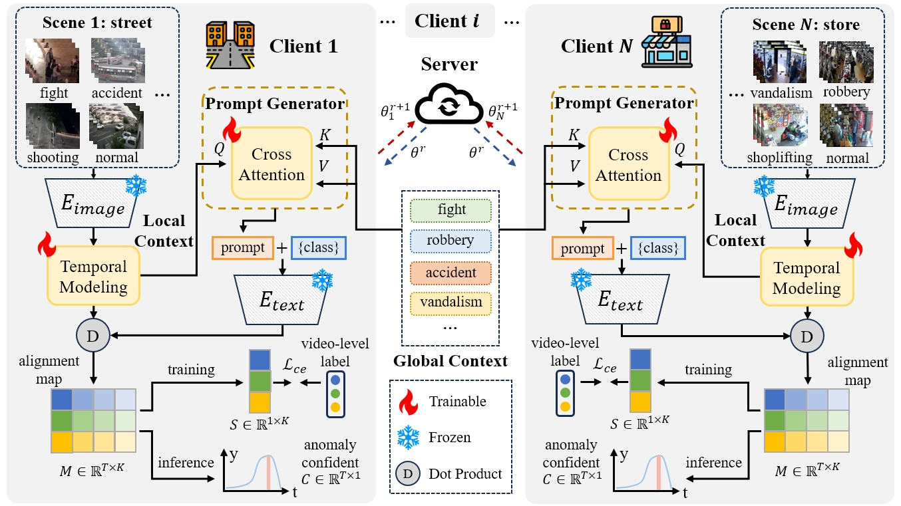

# Federated Weakly Supervised video Anomaly Detection with Multimodal Prompt (AAAI2025)



## 🎨 Highlights
* 📹 We propose a novel privacy protected federated learning framework for video anomaly detection, which enables multiple clients to train a unified and generalized video anomaly detector with privacy.
* 🛰️ We design a prompt generator driven by both global and local contexts, which achieves global generalization and local personalization.
* 🧾 We conduct extensive experiments on multiple datasets. In order to simulate real-world scenarios, we re-organize XD-Violence and UCF-Crime datasets. The results demonstrate the superiority of the proposed method.

## 🔰 Get Started
### 🎈 Preparation
* Clone the repository and download depencies. And we use `torch==2.1.0+cu118`.
```bash
git clone https://github.com/wbfwonderful/Fed-WSVAD.git
cd Fed-WSVAD
conda create -n fed-wsvad python=3.11
conda activate fed-wsvad
pip install -r requirements.txt
```
* Download the CLIP features for UCF-Crime and XD-Violence datasets from [VadCLIP](https://github.com/nwpu-zxr/VadCLIP).
* Modify the path in the CSV files in `/data/list` based on the the saving location of the features.

### 🏃 Training
Run the following commands to train the model in different settings and feel free to change the parameters refer to `utils/config.py`.
```python
# for xd event:
python train.py --dataset xd --batch_size 128 --clients_num 6

# for xd random:
python train.py --dataset xd --batch_size 128 --clients_num 10 --split_mode random

# for xd scene:
python train.py --dataset xd --batch_size 128 --clients_num 13 --split_mode scene

# for ucf event:
python train.py

# for ucf random:
python train.py --split_mode random --clients_num 10

# for ucf scene:
python train.py --split_mode scene --clients_num 9

```
### 🧪 Inference
Set `--chechpoint` to specify the path of chechpoints.
```python
# for xd:
python inference.py --dataset xd --checkpoint model.pth
# for ucf:
python inference.py --checkpoint model.path
```

## 🏄‍♂️ References
We referenced the repos below for the code. Thanks for their contributions! 🤗
* [VadCLIP](https://github.com/nwpu-zxr/VadCLIP)
* [FedTPG](https://github.com/boschresearch/FedTPG)
